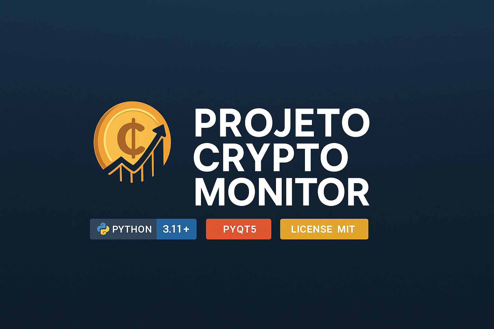
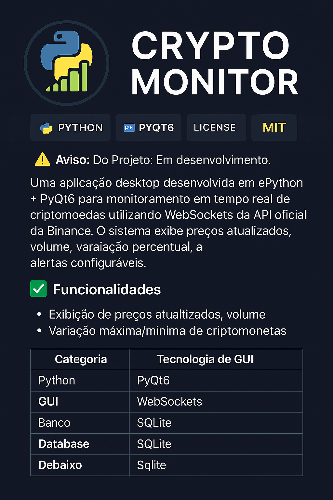

<p align="center">
  
</p>

<h1 align="center"> CRYPTO MONITOR</h1>

<p align="center">
  
</p>

<p align="center">
  <a></a>
  <a></a>
  <a></a>
</p>

---

#  Aviso
**Status do Projeto:** Em desenvolvimento.

Aplicação desktop desenvolvida em **Python + PyQt6** para monitoramento em tempo real de **criptomoedas**, utilizando **WebSockets da API oficial da Binance**.  
O sistema exibe **preços atualizados**, **volume**, **variação percentual**, **máximas/mínimas**, e permite configurar **alertas personalizados**.

---

#  Funcionalidades

###  Monitoramento em tempo real
- Preços atualizados em tempo real (via WebSocket)
- Volume de mercado
- Variação percentual (24h)
- Máximas e mínimas do dia

###  Sistema de Alertas
- Criação de alertas personalizados por preço
- Notificações visuais
- Lista de alertas ativos

###  Dashboard interativo
- Interface moderna desenvolvida com PyQt6
- Tabela dinâmica com dados de mercado
- Atualização automática em tempo real

---

#  Capturas de Tela

##  Página Principal
<p align="center">
  
</p>

---

##  Configuração de Alertas
<p align="center">
  
</p>

---

#  Tecnologias Utilizadas

| Categoria | Tecnologia |
|----------|------------|
| **Linguagem** | Python |
| **GUI** | PyQt6 |
| **Comunicação** | WebSockets |
| **Banco de Dados** | SQLite |
| **Controle de Versão** | Git & GitHub |

---

#  Como executar o projeto

##  Clone o repositório
```bash
git clone https://github.com/MatheusPereiira/crypto-monitor.git
cd crypto-monitor
```

##  Crie um ambiente virtual
```bash
python -m venv venv
```

### Ativar ambiente:

**Windows:**
```bash
.\venv\Scripts\activate
```

**Linux/MacOS:**
```bash
source venv/bin/activate
```

##  Instale as dependências
```bash
pip install -r requirements.txt
```

##  Execute o aplicativo
```bash
python main.py
```

---

#  Estrutura do Projeto

```bash
projeto_crypto/
├── core/               # Lógica principal e comunicação com a API
├── ui/                 # Telas e componentes PyQt6
├── resources/          # Arquivos JSON e dados auxiliares
├── screenshots/        # Capturas de tela usadas no README
├── banner.png          # Banner do projeto
├── logo.png            # Logo do projeto
├── main.py             # Arquivo principal
├── requirements.txt    # Dependências do projeto
└── README.md
```

---

#  Licença
- Este projeto está licenciado sob a **MIT License**.  
- Você pode usar, modificar e distribuir livremente.

---

#  Autor
**Matheus Pereira**  
 - Apaixonado por Python, automação e desenvolvimento desktop.  
 - GitHub: https://github.com/MatheusPereiira  

---

